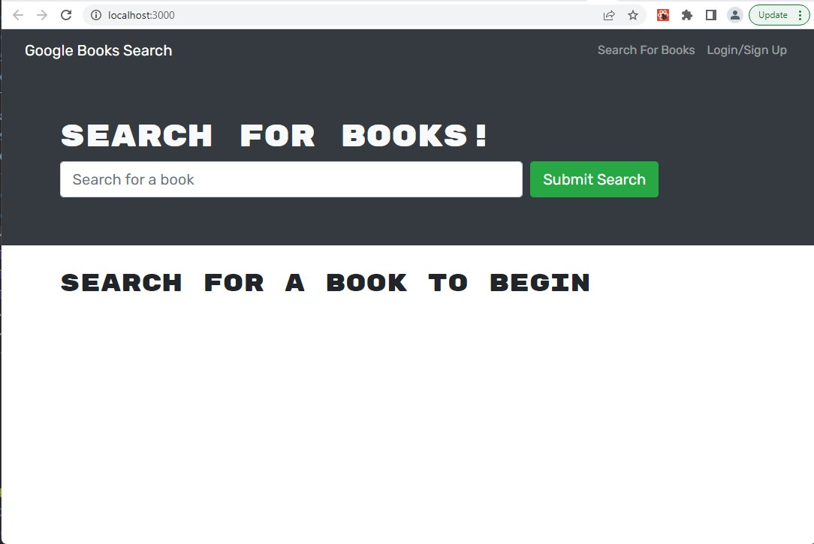
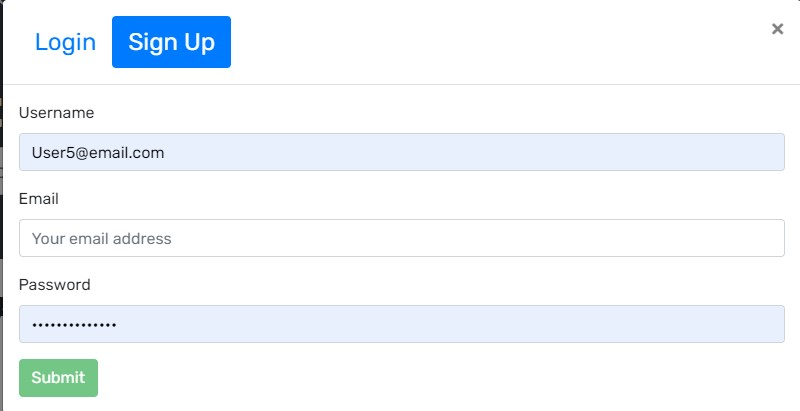
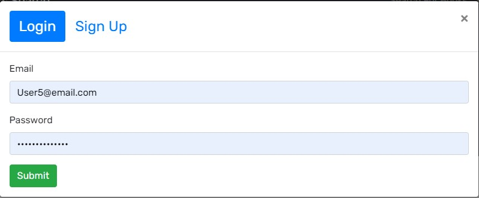
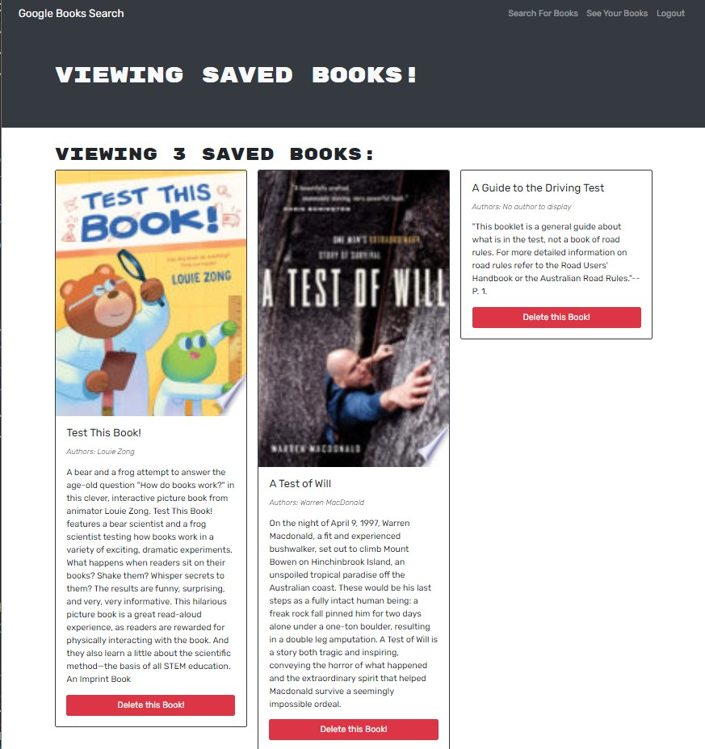

# Google Books Search

Refactored a fully functioning Google Books API search engine that is built with a RESTful API to be a GraphQL API built with Apollo Server.

The app was built using the MERN stack with a React front end, MongoDB database, and Node.js/Express.js server and API.

It allow users to search for books and save book searches to the back end.

# Screen shots 
The web application's appearance and functionality.

## Landing page
Allow the user to search for books or login

## Sign up and Login pages

## Saved Books Page
The user can save books by clicking "Save This Book!" under each book:
